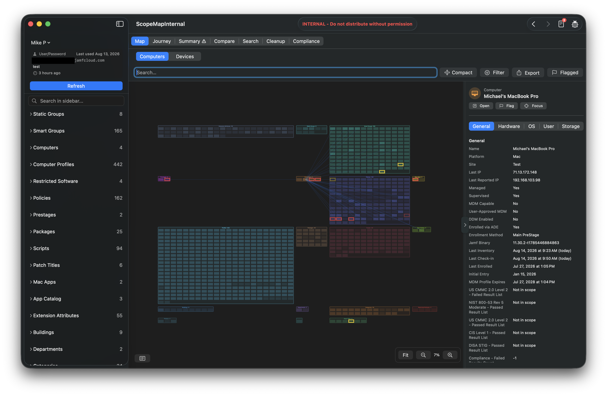
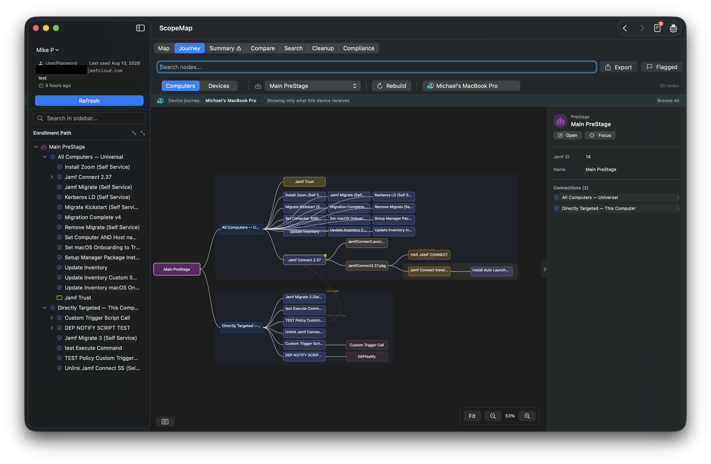
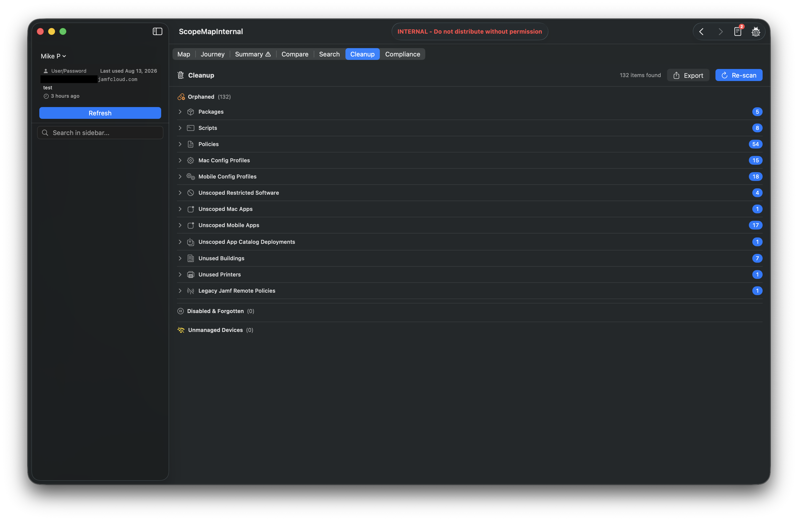

# ScopeMap

ScopeMap is a native macOS app that visualizes how policies, configuration profiles, apps, and groups connect inside a Jamf Pro environment. It draws the relationships Jamf Pro's web interface can't show you on one screen: which objects deploy to which devices, why a device received (or didn't receive) something, and where the cruft is hiding.

- [Features](#features)
- [Editions](#editions)
- [Installing](#installing)
- [Requirements](#requirements)
- [Jamf Pro API privileges](#jamf-pro-api-privileges)
- [What ScopeMap can and can't evaluate](#what-scopemap-can-and-cant-evaluate)
- [Deleting objects (Destructive Mode)](#deleting-objects-destructive-mode)
- [Privacy and security](#privacy-and-security)
- [Logs](#logs)
- [Troubleshooting](#troubleshooting)
- [Reporting a bug](#reporting-a-bug)
- [Getting help](#getting-help)
- [License](#license)

## Features

### Visualize

- **Map** — an interactive graph of computers or mobile devices and everything scoped to them: smart and static groups, policies, configuration profiles, Mac and mobile apps, App Installers, Restricted Software, Patch Titles, packages, scripts, printers, PreStage enrollments, Enrollment Customizations, extension attributes, Blueprints, and your buildings, departments, and categories.
- **Journey** — the full path a device takes from enrollment (PreStage) through group membership to every policy, profile, app, package, and script it would receive — including cascades, where installed software triggers smart-group membership that delivers more software.
- **Compare** — side-by-side comparison of two devices, policies, profiles, packages, or scripts, including effective-scope evaluation ("applies / does not apply / unknown").
- **Inspector** — select any object to see its scope, its relationships in both directions, and a direct link to open it in Jamf Pro.

### Investigate

- **Search** — full-text search across loaded configuration profile payload settings, so you can find which profile actually sets a given key.
- **Summary** — import a Jamf Pro Summary file (text or JSON) to review licensing, database health, and server configuration.
- **Compliance** — view Jamf Compliance Benchmark results pulled from the Jamf Platform API, including per-benchmark pass rates. Read-only.
- **Filters** — narrow the map by name, object type, site, staleness, scope status, managed state, group emptiness, policy enabled state, and saved advanced searches.
- **Flags and notes** — flag any object and attach a note as you work, then include the flagged set in an export.

### Clean up

- **Cleanup** — surfaces orphaned packages and scripts, unscoped enabled policies, empty static groups, disabled policies, and other environment cruft, with exportable findings. An optional, off-by-default **Destructive Mode** can delete surfaced objects directly (see [Deleting objects](#deleting-objects-destructive-mode)).
- **Risk warnings** — flags configurations that are easy to miss, including login/startup-triggered policies whose check-in setting means the trigger can never fire, deeply nested smart-group chains, and objects affected by Inventory Preload.
- **Health Check** *(internal edition)* — a printable report of stale devices, unscoped objects, unused buildings and departments, and more.

### Work with the results

- **Export** — CSV, JSON, Markdown, HTML, and PNG output for the current view, a selected object, or a full environment report.
- **Cached snapshots** — reopen the last scan of a server instantly without re-querying the API, so you can keep working offline.
- **Activity log** — every API call, timing, and error in one window, with a toolbar badge when something fails during a scan.

## Editions

ScopeMap builds in two editions, and **two features differ between them**:

| | Internal | External |
|---|---|---|
| Health Check report | Yes | — |
| Destructive Mode (delete) | — | Yes |

Everything else is identical. The internal edition shows a red banner in the title bar; the external edition doesn't. Help → About reports which one you're running.

## Installing

Download the latest notarized installer package from the [Releases](../../releases) page and run it. The app is signed and notarized by Apple, so it opens normally — no Gatekeeper warnings and no right-click workaround needed.

To build from source instead, clone the repository and open `ScopeMap.xcodeproj` in Xcode 16 or later. The scheme builds the external edition by default; the `*-Internal` build configurations produce the internal edition.

## Requirements

- **macOS 14.0 or later** (Apple silicon or Intel)
- **Jamf Pro** with API access (Classic + Pro API)
- **Jamf Platform API credentials** — only for Blueprints and the Compliance tab. Everything else works without them.
- **Xcode 16 or later** — only to build from source

## Jamf Pro API privileges

By default ScopeMap is a **read-only reporting tool** — it never creates, modifies, or deletes anything on your server. Create a dedicated API role with **Read** privileges on the objects you want visualized:

Computers, Mobile Devices, Smart/Static Computer Groups, Smart/Static Mobile Device Groups, Policies, macOS Configuration Profiles, Mobile Device Configuration Profiles, Mac Applications, Mobile Device Applications, App Installers, Restricted Software, Patch Management, Packages, Scripts, Printers, Computer PreStage Enrollments, Mobile Device PreStage Enrollments, Enrollment Customizations, Buildings, Departments, Categories, Computer Extension Attributes, Mobile Device Extension Attributes, Jamf Pro User Accounts & Groups.

A Jamf Pro user with the **Auditor** role covers all of the above.

Both auth modes are supported: a Jamf Pro user account (username/password) or an API client (client ID/secret).

The one exception to read-only is the optional Destructive Mode described below. It is disabled by default and its delete controls stay hidden unless you turn it on. If you don't enable it, no delete privileges are needed and ScopeMap only ever issues read requests.

## What ScopeMap can and can't evaluate

Scope evaluation is the core of the app, so it's worth being precise about where it stops.

**Evaluated** — scopes built from All Computers/Devices, individual devices, smart and static groups, buildings, departments, and individual Jamf users, as both targets and exclusions. Jamf-user matching uses each device's assigned username and is therefore approximate when assignments are stale; the UI labels these matches accordingly.

**Detected but not evaluated** — limitations (LDAP users and groups, network segments, iBeacons) and Jamf user-group targets. These depend on network, directory, or sign-in state at check-in time, which no amount of inventory data can reconstruct. Objects using them are never reported as unscoped, and Compare reports them as "unknown" rather than guessing.

**Not yet covered as object types** — eBooks and Classes.

## Deleting objects (Destructive Mode)

*External edition only.*

Cleanup surfaces environment cruft — orphaned packages and scripts, empty static groups, unscoped or disabled objects. To act on those findings from within ScopeMap, you can enable **Destructive Mode**, which deletes surfaced objects through the Jamf Pro API.

Destructive Mode is built to be hard to trigger by accident:

- It is **off by default**. All delete controls are hidden and the app behaves as a pure read-only reporting tool until you turn it on.
- It lives in **Preferences → Advanced**, deliberately separated from everyday controls, and turning it on requires an explicit confirmation.
- Deleting is a two-step action: select items in Cleanup, then confirm in a dialog that lists exactly what will be removed.
- Every deletion is **permanent, cannot be undone, and is recorded in the activity log**.

Deletion is supported for scripts, packages, policies, macOS and mobile configuration profiles, restricted software, static computer and mobile groups, buildings, departments, printers, and Mac and mobile apps. **Computers and mobile devices are never deletable** — removing their records carries MDM consequences — and App Catalog deployments must be removed in Jamf Pro directly.

Destructive Mode needs **Delete** privileges on the object types you intend to remove, in addition to the Read privileges above. The Auditor role does not include them. If your account has only Read access, deletes fail with a permissions error and nothing is changed.

## Privacy and security

- Server credentials are stored only in the **local macOS Keychain**, never on disk in plain text.
- Cached server snapshots are stored locally in the app's sandboxed container.
- The app is sandboxed with outgoing-network and user-selected-file entitlements only.
- **Minimal, anonymous usage analytics.** ScopeMap sends a single anonymous "launched" signal to [TelemetryDeck](https://telemetrydeck.com) at startup, so the Concepts team can see adoption. No device, server, credentials, or Jamf object data is ever included. Opt out anytime in Preferences → General → Privacy (takes effect on next launch).

The other time ScopeMap sends anything anywhere else is when *you* file a bug report, described next. Nothing beyond the launch signal above is transmitted automatically, and nothing else leaves without you reading it first.

See [SECURITY.md](SECURITY.md) to report a vulnerability. Do not use a public issue for security reports.

For Jamf's corporate privacy practices, see the [Jamf Privacy Policy](https://www.jamf.com/trust-center/privacy/privacy-policy/).

## Logs

ScopeMap doesn't write a log file to disk. Every API call, its timing, and any error is recorded in the in-app **Activity log** (toolbar icon, badged when something fails during a scan) for the current session — it isn't persisted between launches. There is no separate debug/verbose mode to enable; the Activity log already shows full request timing and error detail.

## Troubleshooting

- **"Certificate not trusted" or TLS errors connecting to a Jamf Pro server** — this usually means the server uses a self-signed or internally-issued certificate that isn't in your Mac's trust store. Add the certificate to your login or System keychain and mark it trusted, then reconnect.
- **403 / permission errors during a scan** — the API account or role you're using is missing a Read privilege for one of the object types listed in [Jamf Pro API privileges](#jamf-pro-api-privileges). Check the Activity log for the specific endpoint that failed and add the corresponding privilege.
- **Destructive Mode delete fails with a permissions error** — your account has Read access but not the Delete privilege for that object type. See [Deleting objects](#deleting-objects-destructive-mode).
- **A scan hangs or never completes** — open the Activity log (toolbar) to see which API call is in progress and whether it's retrying. Very large environments can take longer on the first scan; subsequent scans use the cached snapshot.
- **Still stuck** — use Help → Report a Bug so the report includes your app/macOS version, object counts, and the tail of the activity log.

## Sending feedback

Use **Help → Report a Bug** in the app, or the bug icon in the toolbar. It gathers the context that makes a report actionable — app and macOS version, object counts, active filters, and the tail of the activity log — and lets you attach screenshots.

Your **server URL, hostname, server name, and API account are redacted** from the report before it's sent. Jamf object names (policies, groups, packages) are kept, because they're usually what the bug is about. The full text is shown to you for review before anything is sent, and there's a Copy Report button if you'd rather send it yourself. Attached screenshots can't be redacted — check them for your server URL before adding one.

## License

ScopeMap is provided under the [Jamf Concepts Use Agreement](LICENSE). This software is closed-source; no source code is published or distributed publicly.
